

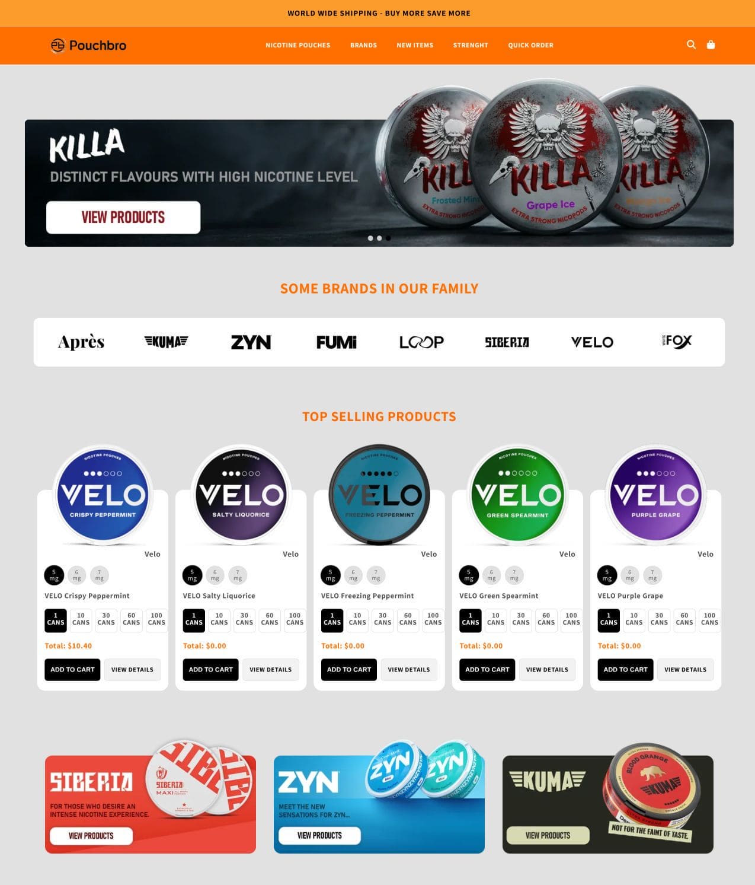
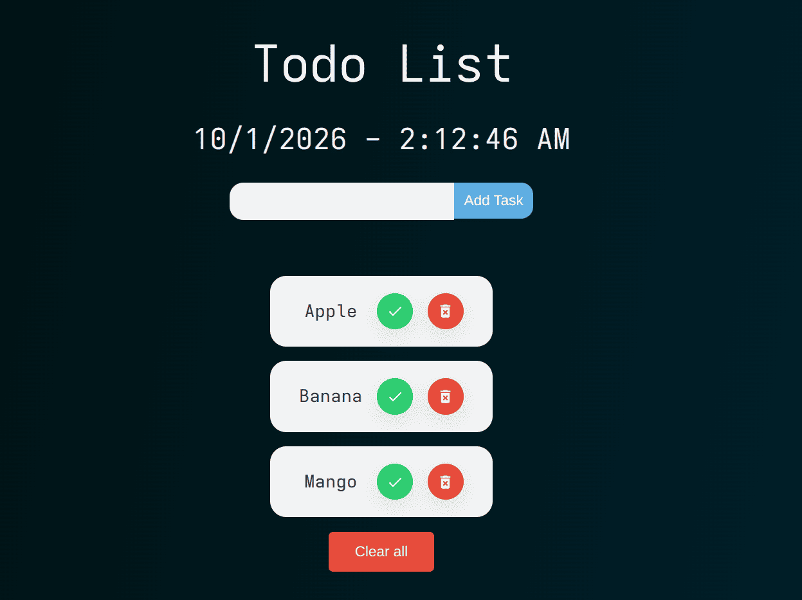
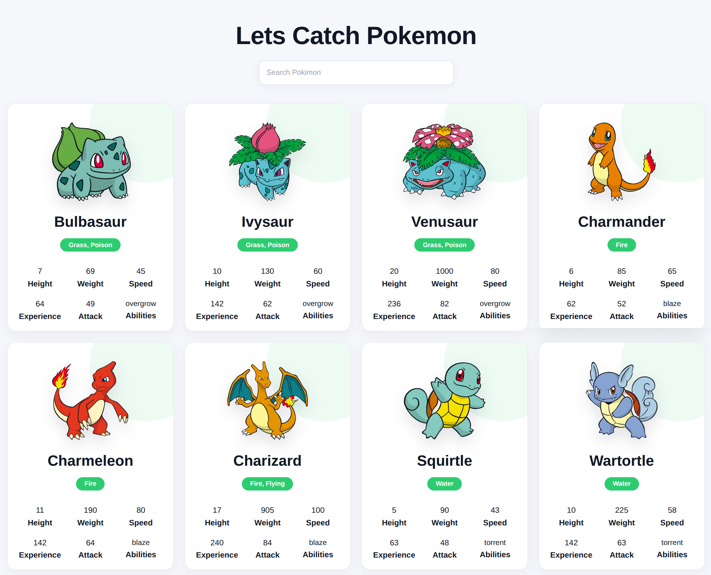
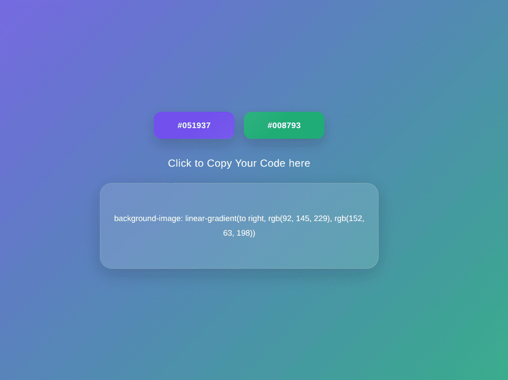
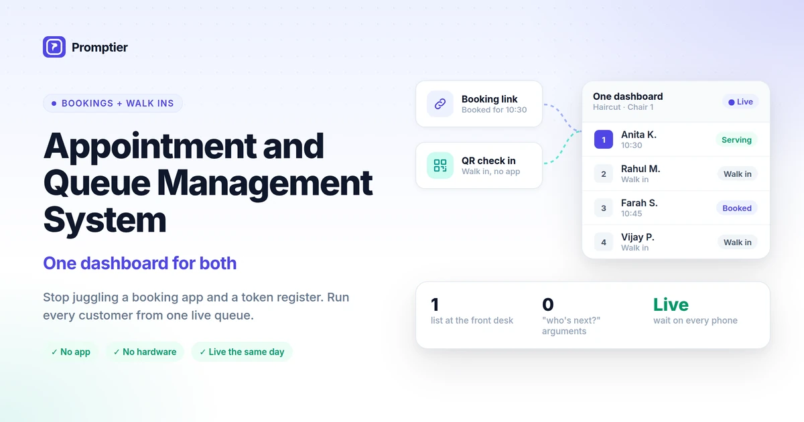

<h1 align="center">Muhammad Rameez</h1>

<h3 align="center">Frontend Engineer | JavaScript, React & Shopify</h3>

Building fast, responsive and accessible web experiences. 
30+ production Shopify storefronts delivered for international clients.

  
  
  

---

## 👨‍💻 About Me

I'm a **Frontend Engineer** and Computer Science student (BS, The Islamia University of Bahawalpur, graduating 2027). Since 2024 I've been building production eCommerce storefronts for international clients, and I'm now growing into **React and full-stack development**.

<table align="center">
  <tr>
    <td align="center"><b>📍 Location</b></td>
    <td align="center">Bahawalpur, Pakistan (open to remote)</td>
  </tr>
  <tr>
    <td align="center"><b>🔭 Building</b></td>
    <td align="center">React and Django projects</td>
  </tr>
  <tr>
    <td align="center"><b>🌱 Learning</b></td>
    <td align="center">TypeScript, Node.js, testing</td>
  </tr>
  <tr>
    <td align="center"><b>💼 Looking for</b></td>
    <td align="center">Frontend Engineer role on a product team</td>
  </tr>
</table>

---

## 🛠 Tech Stack

**Used in shipped work**

`Shopify Liquid` `REST APIs` `Responsive Design` `Web Performance` `Accessibility`

**Currently learning**

---

## 💼 Experience

**Frontend Engineer (Shopify Theme Development)** · Freelance, Fiverr
*Sep 2024 – Present · Remote · International clients*

- Shipped **30+ production storefronts** across multiple industries, owning each project from requirements to launch.
- Built custom **Shopify 2.0 themes** and reusable sections with Liquid, JavaScript, HTML, CSS and Tailwind CSS.
- Implemented Year-Make-Model (YMM) product finders, multi-step survey flows, product customization and custom forms.
- Integrated third-party apps and APIs, and worked directly with clients to turn business goals into technical solutions.

---

## 🚀 Featured Projects

### 🛒 Client Work: Live Shopify Stores

<table>
  <tr>
    <td width="33%" align="center">
      
        
      <b>Nature's Blessing</b>
       
      Health & skincare store with bundle offers and conversion-focused sections
        
      <a href="https://naturesblessing.store/">🌐 Live Store</a>
    </td>
    <td width="33%" align="center">
      
        
      <b>C2 Paint</b>
       
      C2 Paint offers premium, pigment-rich paints with exceptional depth, coverage and true color performance
        
      <a href="https://c2paint.com/">🌐 Live Store</a>
    </td>
    <td width="33%" align="center">
      
        
      <b>PouchBro</b>
       
      Niche product brand store with a custom, conversion-focused UI
        
      <a href="https://www.pouchbro.com/">🌐 Live Store</a>
    </td>
  </tr>
</table>

  
  
  
  

---

### 💻 Frontend Projects

<table>
  <tr>
    <td width="33%" align="center">
      
        
      <b>Task Manager</b>
       
      React task manager with create, edit, delete and completion workflows
        
      <a href="https://taskader.netlify.app/">🌐 Live Demo</a>
      &nbsp;•&nbsp;
      <a href="https://github.com/rameezwebdev/react-todo-app.git">💻 Source</a>
    </td>
    <td width="33%" align="center">
      
        
      <b>Pokemon</b>
       
      Responsive Pokemon Characters using REST API data with search and error states
        
      <a href="https://pokemon-ca.netlify.app/">🌐 Live Demo</a>
      &nbsp;•&nbsp;
      <a href="https://github.com/rameezwebdev/react-pokemon-web.git">💻 Source</a>
    </td>
    <td width="33%" align="center">
      
        
      <b>Gradient Color Picker</b>
       
      Interactive CSS gradient builder with real-time preview and generated CSS
        
      <a href="https://gradient-color-selector.netlify.app/">🌐 Live Demo</a>
      &nbsp;•&nbsp;
      <a href="https://github.com/rameezwebdev/javascript-gradient-picker.git">💻 Source</a>
    </td>
  </tr>
</table>

---

### ⚙️ Full-Stack Project

<table>
  <tr>
    <td width="100%" align="center">
      
        
      <b>🚦 Smart Appointment & Queue Management System</b>
       
      Full-stack queue management system with digital token generation, queue position tracking, role-based workflows and authentication.
        
      <a href="https://github.com/rameezwebdev/django-smart-appointment-web.git">💻 Source Code</a>
    </td>
  </tr>
</table>

  
  
  
  

---

## 🤝 Let's Connect

<h3 align="center">Open to frontend engineering roles, Shopify projects and collaborations.</h3>

  
  

